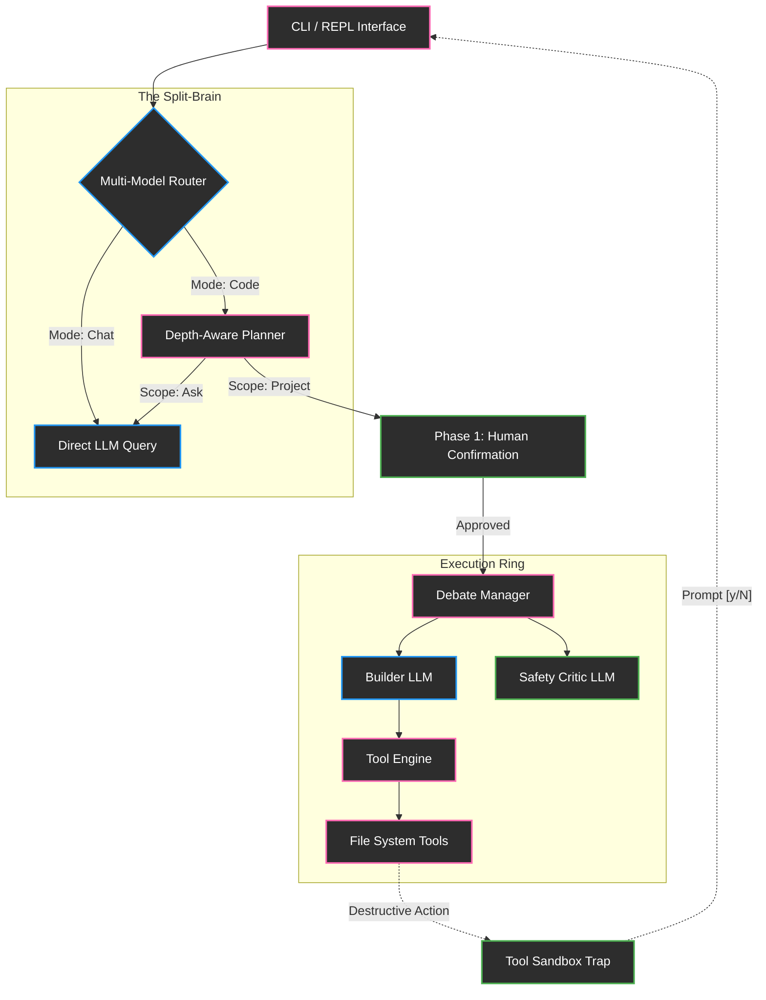

```text
 _  _ __  ___ ___ _  _  ___  __  __  ___ 
| |/ /_ _|_ _|_ _| || |/ __|/__\/_ \/ __|
| ' < | | | | | | \_. | (__| \/ | \/ (__ 
|_|\_\___|___|___|___/ \___|\__/\__/\___|
```

# KittyCode CLI

An autonomous, multi-model AI software engineering co-pilot designed for local development.

---


## Key Features

- **Multi-Model Intelligence Routing:** Built-in fault tolerance. If the primary inference engine fails or rate-limits, the system automatically falls back to secondary models without dropping the session state.
- **Architectural Debate Engine:** For complex tasks, the system splits into a swarm. A `Builder` agent writes the implementation, while a `Critic` agent validates logic, security, and context alignment before execution.
- **Project-Scoped Sandboxing:** Operations are securely sandboxed to the current working directory. Directory traversal attempts (`../`) are intercepted and blocked at the engine layer.
- **Deterministic Action Gating:** Destructive system operations (writing files, executing bash commands, deleting directories) physically halt the execution thread and require explicit human `[y/N]` terminal confirmation.
- **Local Semantic Memory:** Context is continuously mapped via local vector embeddings (FAISS + SentenceTransformers), allowing the agent to perform RAG-based context retrieval on project-specific histories.
- **Transparent Work Logs:** Every action, API call, and internal reasoning step is structured, traced, and logged locally.

---

## Architecture Overview

KittyCode employs a split-brain, agentic pipeline to ensure execution reliability.



### 1. The Multi-Model Fallback Chain
Operating autonomous agents is subject to API volatility. The `ModelRouter` is configured with a deterministic fallback chain:
1. **Primary:** `openai/gpt-4.1` (Default for high-reasoning tasks)
2. **Fallback 1:** `anthropic/claude-sonnet-4-5`
3. **Fallback 2:** `anthropic/claude-haiku-4-5`
4. **Fallback 3:** `google/gemini-2.5-pro`

If `gpt-4.1` throws an HTTP 429 or 500 block, the router gracefully degrades to `claude-sonnet-4-5`, continuing the execution loop seamlessly.

### 2. The Debate Engine
When the depth-analyzer evaluates a task as complex (requiring multiple sequential file modifications), the Debate Engine engages:
- The **Builder** generates the file diffs and command executions.
- The **Critic** intercepts the Builder's payload, verifying it against the project constraints and looking for immediate bugs.
- If the Critic rejects the code, the Builder is forced to revise. If it passes, the payload is yielded to the tool execution engine.

### 3. Sandbox Security Model
The `SandboxValidator` acts as a kernel-level interceptor. Every path intended for modification is resolved absolutely. If `os.path.commonpath([sandbox_root, target_path])` does not equal `sandbox_root`, a `PermissionError` is thrown directly to the agent, aborting the write sequence.

---

## Installation

### Prerequisites
- Python 3.12+
- Git

### From Source
```bash
git clone https://github.com/Quantum-Blade1/kitty-CLI.git
cd kitty-CLI
python -m venv venv
source venv/bin/activate  # On Windows: venv\Scripts\activate
pip install -r requirements.txt
```

---

## Quick Start

Initialize a session within your target repository:

```bash
cd /path/to/your/project
python /path/to/kitty-CLI/main.py
```

### Example Usage

**1. Fast Conceptual Queries (Chat Mode)**
```text
> talk to kitty(chat)... How do I implement a sliding window algorithm?
```
*(Bypasses the planner and tool payloads for an instant, streaming response)*

**2. Scaffolding Modules (Code Mode)**
```text
> talk to kitty(code)... Scaffold a python REST API using FastAPI with a SQLite database.
```
*(Generates a multi-step task queue, prompts the user for execution approval, and builds the files)*

**3. Bypassing Planner Explicitly**
```text
> talk to kitty(code)... ask exactly how pagination works in this framework.
```

---

## Configuration

KittyCode utilizes standard environment variables for secret management.

Copy the `.env.example` file to `.env`:
```env
BYTEZ_API_KEY=your_bytez_api_key_here
```

### Local Settings
Configuration configurations are managed via a `.kitty` directory mapped into your local project root. 
- **Model Switching:** Use the `/model` conversational command to hot-swap the primary intelligence engine.
- **Theme Selection:** Interface aesthetics are prompted upon session initialization and persisted.

---

## Command System

KittyCode utilizes an explicit JSON-based tool payload system injected into the system prompt.

### Safe Operations (Auto-Execution)
- `read`: Reads file buffers into context.
- `ls`: Maps directory structures.
- `mem`: Embeds or retrieves vector memories.

### Dangerous Operations (Gated Confirmation)
If the tool registry flags an action as `destructive: true`, the execution thread pauses.
- `write`: Modifies disk storage.
- `mkdir`: Creates directories.
- `delete`: Removes assets.
- `run_cmd`: Executes bash/powershell scripts.

```text
[Engine] ⚠️ The agent has requested to execute: `pip install requests`
Do you want to allow this operation? [y/N]
```

---

## Project Structure

```text
kittycode/
├── agent/
│   ├── kitty.py        # Core agent orchestration and loop management
│   ├── planner.py      # Depth-aware queue generation and scope analysis
│   └── debate.py       # Multi-agent Builder/Critic swarm logic
├── cli/
│   ├── app.py          # Primary REPL and Terminal UI loops
│   └── ui.py           # Rich console rendering components
├── core/
│   └── critic.py       # Deterministic safety rule enforcement
├── memory/
│   ├── manager.py      # FAISS vector database integration
│   └── history.py      # Conversation window sliding and summarization
├── models/
│   ├── router.py       # Intelligent fallback routing and execution
│   ├── health.py       # Endpoint latency and failure tracking
│   └── registry.py     # Static model configuration and preferences
├── security/
│   └── sandbox.py      # Hardened directory traversal prevention
├── telemetry/
│   └── logger.py       # Structured JSON JSON telemetry and trace IDs
└── tools/
    ├── engine.py       # Primary execution interceptor and sandbox host
    ├── registry.py     # Dynamic JSON schema definitions for the LLM
    └── fs_tools.py     # Abstracted file system operation implementations
```

---

## Security Model

KittyCode is designed with strict boundaries to protect the host machine from autonomous hallucination.

1. **Workspace Isolation:** All `fs_tools` operations are bounded to the directory where the CLI was invoked.
2. **Reasoning Mode Data Protection:** When the agent processes a logic-only step, structural tool schemas (like `write_file`) are physically stripped from the context buffer. The agent mathematically cannot command a file write because it does not possess the syntax format.
3. **Execution Timeouts:** `run_cmd` operations are bound by a hard 60-second timeout to prevent runaway event loops or infinite while loops from locking the thread.

---


## Contributing

We welcome contributions to the KittyCode orchestration engine.
1. Fork the repository.
2. Create a feature branch: `git checkout -b feature/sandbox-enhancement`
3. Commit your changes: `git commit -m 'feat: added strict symlink validation'`
4. Push to the branch: `git push origin feature/sandbox-enhancement`
5. Open a Pull Request.

Please ensure all PRs pass the strict `flake8` CI checks before submission.

---

## License

*(License Placeholder - e.g., MIT, Apache 2.0)*

---

## Philosophy & Origins

KittyCode began as a bespoke automation script—a surprise gift written by the original developer for a close friend. The goal was to build an interface that felt deeply personal, helpful, and conversational. As the architecture scaled to include complex multi-agent swarms, vector databases, and fault-tolerant routing, it evolved into a production-grade orchestration engine.

Our philosophy remains unchanged: A developer tool should not only be structurally robust and secure, but it should also feel like a dedicated companion in your workspace. 

*— Built by Krish (GitHub: Quantum-Blade1)*
